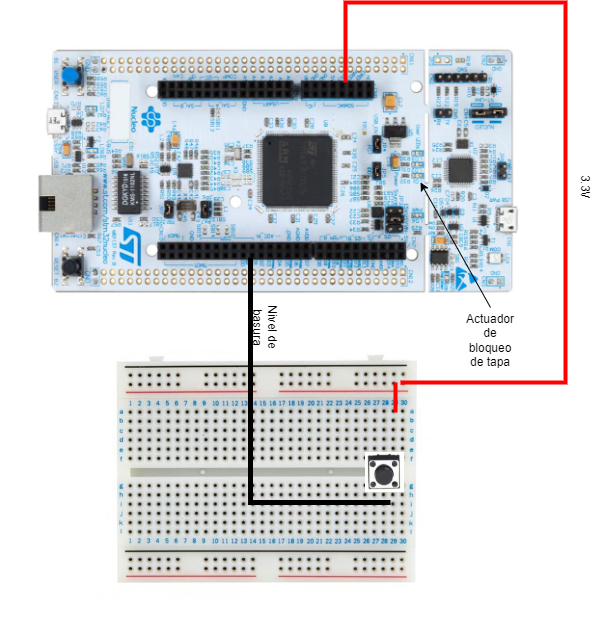

# SiMBa (Sistama de Monitoreo de Basura)

## Alumno: Agustín Ruiz
## Descripción
La recolección de basura en la Ciudad de Buenos Aires es compleja y requiere de una inversión en recursos elevada. 
La recolección de residuos se realiza de forma agendada en donde los recolectores realizan una ruta definida. 
Debido a que los containers no siempre están cargados, o están cargados de más, se propone un sistema de monitoreo para llevar un registro en tiempo real del estado de los contenedores. 
El sistema se compone de dos partes. Por un lado, un sistema embebido capaz de realizar un sondeo de los parámetros del contenedor tales como: Capacidad, Humedad, Detección de gas, temperatura, presión, y también de accionar algunos mecanismos a implementar en el contendor como ventilación, bloqueo de la tapa, indicador de bateria. 
Por otro lado, se dispondrá de una central de datos que recepcionará todas las variables de los dispositivos que permitirá la implementación de rutas de recolección dinámicas, analisis de datos y utilización eficiente de los recursos. 
De esta forma se puede dar un mejor seguimiento al problema ambiental de la recolección de basura y una mejora en la eficacia de las políticas ambientales de la ciudad. 
## Plataforma de desarrollo:  NUCLEO-F429ZI
## Periféricos a utilizar: 
  - Sensor de nivel (Entrada Digital) (D1): Si esta encendido indica que el contenedor está lleno.
  - Sensor de gas (Entrada Analógica) (A0): Si supera un umbral indica que se detectó gas. Posible riesgo de incendio.
  - Sensor de temperatura (Entrada Analógica) (A1): Si la temperatura aumenta a un nivel acciona la alarma.
  - Detector De Humedad (Entrada Analógica) (No implementado aún): Sensa el nivel de humedad en el contenedor. Variable influyente en el riesgo de incendio. 
  - Display (I2C): Indicador visual del estado del tacho. 
  - Sensor Tapa (Entrada Digital) (No implementado aún): Si esta encendido indica que la tapa esta cerrada.
  - Actuador Matafuegos (Salida Digital) (No implementado aún): Si esta en alto se abre el matafuegos.
  - Actuador Traba de la Tapa (Salida Digital) (LED1): Con esta salida se puede bloquear la tapa.  
  - Actuador Tapa Ventilación (Salida Digital) (No implementado Aun): Si está en alto se abre la tapa de ventilación.
  - Alarma (Salida Digital) (D2): Señal auditiva indicadora de posible incendio. 
  - UART: Comunicación con la computadora. Para enviar y recibir comandos. 

## Primera Entrega
En esta entrega se realizó la programación de un código que maneja: el sensor de nivel y el actuador de la tapa. 

El actuador de la tapa es en este caso el LED1 y el sensor de nivel es el puerto D1. 

Se adjunta una imagen de las conecciones de esta entrega. 

## Segunda entrega
En esta entrega se realizó la programación de la máquina de estados y se agregago un display para indicar el estado del tacho. 

La maquina de estados dispone de cuatro estados: Inicio, TapaTrabada, TapaDestrabada, GasDetectado. 

Desde el inicio se puede ir a todos los demas estados, sin embargo, solo se puede pasar por el una sola vez porque es para iniciar sensores. 

Se incluyó el sensor de temperatura junto con un amplificador operacional en modo no inversor para amplificar la pequeña señal de temperatura, y se colocó el OpAmp en 0 a 3.3V. 

También se incluyó un display para mostrar el estado actual. Y por último, se incluyó una entrada analógica simulando el sensor de gas. 

A continuación un enlace a un video con una demostración del funcionamiento del mismo. 

