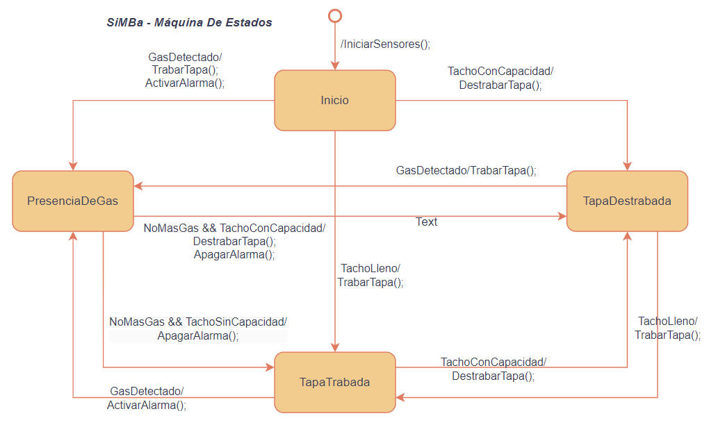

# SiMBa (Sistama de Monitoreo de Basura)

## Alumno: Agustín Ruiz
## Descripción
La recolección de basura en la Ciudad de Buenos Aires es compleja y requiere de una inversión en recursos elevada. 
La recolección de residuos se realiza de forma agendada en donde los recolectores realizan una ruta definida. 
Debido a que los containers no siempre están cargados, o están cargados de más, se propone un sistema de monitoreo para llevar un registro en tiempo real del estado de los contenedores. 
El sistema se compone de dos partes. Por un lado, un sistema embebido capaz de realizar un sondeo de los parámetros del contenedor tales como: Capacidad, Humedad, Detección de gas, temperatura, presión, y también de accionar algunos mecanismos a implementar en el contendor como ventilación, bloqueo de la tapa, indicador de bateria. 
Por otro lado, se dispondrá de una central de datos que recepcionará todas las variables de los dispositivos que permitirá la implementación de rutas de recolección dinámicas, analisis de datos y utilización eficiente de los recursos. 
De esta forma se puede dar un mejor seguimiento al problema ambiental de la recolección de basura y una mejora en la eficacia de las políticas ambientales de la ciudad. 
## Plataforma de desarrollo:  NUCLEO-F429ZI
## Periféricos a utilizar: 
  - Sensor de nivel (Entrada Digital) (D1): si esta encendido indica que el contenedor está lleno.
  - Sensor de gas (Entrada Analógica) (A0): si supera un umbral indica que se detectó gas. Posible riesgo de incendio.
  - Sensor de temperatura (Entrada Analógica) (A1): si la temperatura aumenta a un nivel acciona la alarma.
  - Detector De Humedad (Entrada Analógica) (No implementado aún): sensa el nivel de humedad en el contenedor. Variable influyente en el riesgo de incendio. 
  - Display (I2C): Indicador visual del estado del tacho. 
  - Sensor Tapa (Entrada Digital) (No implementado aún): si esta encendido indica que la tapa esta cerrada.
  - Actuador Matafuegos (Salida Digital) (No implementado aún): si esta en alto se abre el matafuegos.
  - Actuador Traba de la Tapa (Salida Digital) (LED1): con esta salida se puede bloquear la tapa.  
  - Actuador Tapa Ventilación (Salida Digital) (No implementado Aun): si está en alto se abre la tapa de ventilación.
  - Alarma (Salida Digital) (D2): señal auditiva indicadora de posible incendio. 
  - UART: comunicación con la computadora. Para enviar y recibir comandos. 

## Primera Entrega
En esta entrega se realizó la programación de un código que maneja: el sensor de nivel y el actuador de la tapa. 

El actuador de la tapa es en este caso el LED1 y el sensor de nivel es el puerto D1. 

Se adjunta una imagen de las conexiones de esta entrega. 

## Segunda entrega
En esta entrega se realizó la programación de la máquina de estados y se agregago un display para indicar el estado del tacho. 

La maquina de estados dispone de cuatro estados: Inicio, TapaTrabada, TapaDestrabada, GasDetectado. 

Desde el inicio se puede ir a todos los demas estados, sin embargo, solo se puede pasar por el una sola vez porque es para iniciar sensores. 

Se incluyó el sensor de temperatura junto con un amplificador operacional en modo no inversor para amplificar la pequeña señal de temperatura, y se colocó el OpAmp en 0 a 3,3 V. 

También se incluyó un display para mostrar el estado actual. Y por último, se incluyó una entrada analógica simulando el sensor de gas. 

A continuación un enlace a un video con una demostración del funcionamiento del mismo. 

### Explicación de las conexiones

### Demostración

### Sobre la maquina de estados (maquinaDeEstados.cpp)
La maquina de estados se encuentra definida en el archivo maquinaDeEstados.cpp. Básicamente define tres clases: 
-  MaquinaDeEstados: se encarga de gestionar la maquina de estados. Funciona solamente como un contenedor y tiene un puntero hacia el estado actual. Al inicializarse se debe colocar el primer estado de donde debe realizarse el procesamiento. Con procesamiento se entiende como la evaluación de si el estado debe avanzar hacia otro estado o continuar en el mismo. 
-  Transicion: este objeto permite la transición entre estados, y es la representación de una arista dirigida si se considera a la máquina de estados como un grafo. Tiene una condición y una acción. La condición permite saber si la máquina debe transicionar a otro estado o no. De ser satisfactoria la condición, se realiza una acción cuyo proposíto puede ser accionar sobre variables del sistema. También se incorpora una Actualización, que es una transición cuya condición es siempre falsa y sirve para ejecutar actualizaciones en las variables del sistema. 
-  Estado:  este objeto define un estado en el sistema y contiene un arreglo de transiciones que se utilizan para conectarlo con otros estados. El estado en esta implementación es simplemente un contenedor de las transiciones.
  
### Estados definidos
El sistema define los siguientes estados:

- INICIO: el estado inicial del sistema donde se realiza la configuración inicial y las actualizaciones.
- TAPA_TRABADA: estado en el que la tapa está bloqueada.
- TAPA_DESTRABADA: estado en el que la tapa está desbloqueada.
- PRESENCIA_DE_GAS: estado en el que se ha detectado la presencia de gas.

A continuación, una imagen con el diagrama de estados que explica cualitativamente el funcionamiento del programa: 

### Transiciones entre estados
Las transiciones determinan cómo moverse de un estado a otro en función de las condiciones detectadas por los sensores. Por ejemplo:

- Inicio a TAPA_DESTRABADA: esta transición se produce si el sistema se inicializa correctamente.
- Inicio a PRESENCIA_DE_GAS: si se detecta gas al inicio, el sistema cambia a este estado y activa la alarma.
- TAPA_DESTRABADA a TAPA_TRABADA: cuando el contenedor está lleno y no hay presencia de gas, la tapa se bloquea.
- TAPA_TRABADA a TAPA_DESTRABADA: se produce cuando hay espacio en el contenedor y no hay presencia de gas.
- PRESENCIA_DE_GAS a TAPA_TRABADA: se activa si el contenedor está lleno pero no hay presencia de gas.
### Lógica de transiciones y acciones
Cada transición está definida con una condición y una acción:

- Condición: una función que devuelve true o false dependiendo del estado de los sensores. Si devuelve true, se activa la transición.
- Acción: una función que se ejecuta cuando se realiza la transición. Por ejemplo, activar una alarma, mostrar mensajes en el display, o bloquear la tapa.
### Funcionamiento
- Inicialización: al iniciar el sistema, se configuran los estados y se realizan las actualizaciones iniciales. Esto incluye mostrar un mensaje en el display y actualizar el estado de los sensores.
- Evaluación del estado: el método Evaluar se ejecuta periódicamente para revisar el estado actual y determinar si debe cambiar a otro estado según las condiciones.
