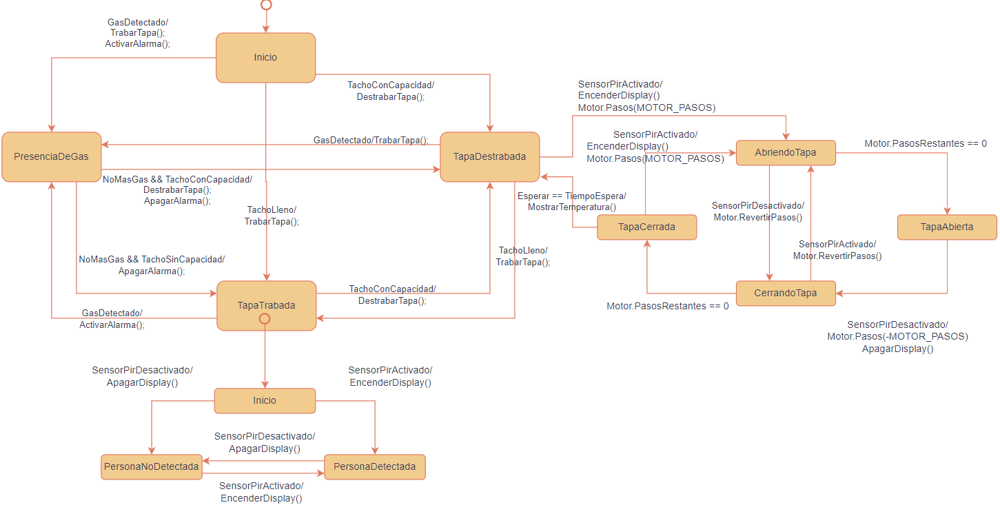

# SiMBa (Sistama de Monitoreo de Basura)

## Alumno: Agustín Ruiz
## Descripción
La recolección de basura en la Ciudad de Buenos Aires es compleja y requiere de una inversión en recursos elevada. 
La recolección de residuos se realiza de forma agendada en donde los recolectores realizan una ruta definida. 
Debido a que los containers no siempre están cargados, o están cargados de más, se propone un sistema de monitoreo para llevar un registro en tiempo real del estado de los contenedores. 
El sistema se compone de dos partes. Por un lado, un sistema embebido capaz de realizar un sondeo de los parámetros del contenedor tales como: Capacidad, Humedad, Detección de gas, temperatura, presión, y también de accionar algunos mecanismos a implementar en el contendor como ventilación, bloqueo de la tapa, indicador de bateria. 
Por otro lado, se dispondrá de una central de datos que recepcionará todas las variables de los dispositivos que permitirá la implementación de rutas de recolección dinámicas, analisis de datos y utilización eficiente de los recursos. 
De esta forma se puede dar un mejor seguimiento al problema ambiental de la recolección de basura y una mejora en la eficacia de las políticas ambientales de la ciudad. 
## Plataforma de desarrollo:  NUCLEO-F429ZI
## Periféricos a utilizar: 
  - Sensor de nivel (entrada digital) (D1): si esta encendido indica que el contenedor está lleno.
  - Sensor de gas (entrada analógica) (A0): si supera un umbral indica que se detectó gas. Posible riesgo de incendio.
  - Sensor de temperatura (entrada analógica) (A1): si la temperatura aumenta a un nivel acciona la alarma.
  - Sensor PIR (entrada digital) (D3): sensor para detectar la presencia de una persona. Si hay una persona, la tapa se abre.  
  - Detector De Humedad (entrada analógica) (no implementado aún): sensa el nivel de humedad en el contenedor. Variable influyente en el riesgo de incendio. 
  - Display (I2C): indicador visual del estado del tacho. 
  - Sensor tapa (entrada digital) (no implementado aún): si esta encendido indica que la tapa esta cerrada.
  - Actuador matafuegos (salida digital) (no implementado aún): si esta en alto se abre el matafuegos.
  - Actuador traba de la tapa (salida digital) (LED1): con esta salida se puede bloquear la tapa.  
  - Actuador tapa ventilación (salida digital) (no implementado aún): si está en alto se abre la tapa de ventilación.
  - Actuador tapa (salida bus de 4 bits) (D4, D5, D6, D7): actúa sobre el motor a pasos que abre la tapa. 
  - Alarma (Salida Digital) (D2): señal auditiva indicadora de posible incendio. 
  - UART: comunicación con la computadora. para enviar y recibir comandos. 

## Tercera entrega
En esta entrega se agregaron el sensor PIR, un motor a pasos que actuará sobre la tapa, manejo de interrupciones y inclución del ticker para tener un sistema menos bloqueante. 

Ahora la máquina de estados contiene los siguientes estados:  `TapaTrabada`, `TapaDestrabada`, `Inicio`, `PresenciaDeGas`, `AbriendoTapa`, `TapaAbierta`, `TapaCerrada` y `CerrandoTapa`

Se incluyó un sensor PIR para detectar la presencia de una persona y así abrir la tapa automáticamente sin tener que tocar el contenedor. 

Se incluyó el manejo de interrupciones para realizar tareas como actualizar los estados de algunos sensores. Dentro de las interrupciones también se incluyeron varios `Ticker` para realizar cuentas regresivas o actualizar el estado de variables analógicas. 

También, a falta de un motor DC, se incluyó un motor a pasos que se utilizará para actuar sobre la tapa. Al motor a pasos se le asignó un Ticker para avanzar o retroceder un paso, de esta forma, el código del motor a pasos no es bloqueante. 

A continuación un video con una demostración del funcionamiento del mismo. 

### Explicación de las conexiones y demostración
 

### Sobre los nuevos estados 
Se incluyeron nuevos estados para el manejo de la tapa por medio del motor. El objetivo es controlar el comportamiento de la tapa con una máquina de estados. Para esto se crearon cuatro estados nuevos:  `AbriendoTapa`, `TapaAbierta`, `TapaCerrada` y `CerrandoTapa` que se comportan según haya o no la presencia de una persona. 

La idea es que el usuario no toque la tapa para arrojar la basura. 

### Los estados pueden tener una máquina de estados adentro
También se incluyó una máquina de estados llamada `pirMaquina` que se asigno al estado de `TapaTrabada`. Ahora todos los estados tienen la posibilidad de tener una maquina de estados interna si se lo requiriece. Desafortunadamente, no llego a explotarse todo el potencial de esta nueva funcionalidad. 

### Estados definidos
El sistema define los siguientes estados:

- INICIO: el estado inicial del sistema donde se realiza la configuración inicial y las actualizaciones.
- TAPA_TRABADA: estado en el que la tapa está bloqueada.
- TAPA_DESTRABADA: estado en el que la tapa está desbloqueada.
- PRESENCIA_DE_GAS: estado en el que se ha detectado la presencia de gas.
- ABRIENDO_TAPA: estado en el que la tapa se está abriendo.
- TAPA_ABIERTA: estado en el que la tapa está abierta.
- TAPA_CERRADA: estado en el que la tapa está cerrada.
- CERRANDO_TAPA: estado en el que la tapa está cerrandose. 

A continuación, una imagen con el diagrama de estados que explica cualitativamente el funcionamiento del programa: 

