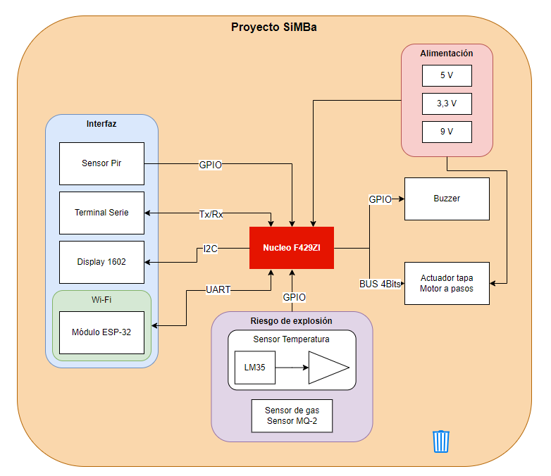

# SiMBa (Sistama de Monitoreo de Basura)

## Alumno: Agustín Ruiz
## Fecha: 2. º cuatrimestre 2024

## 1. Selección del proyecto a implementar
Se proponen dos proyectos para la implementación de un sistema embebido. En primer lugar se propone un sistema de monitoreo de basura que permita llevar un registro en tiempo real del estado de los contenedores de basura. Por otro lado, se propone un sistema de monitoreo de la calidad del aire en una habitación de hospital para detectar la presencia de gases tóxicos y asegurar la asepsia del ambiente.

### 1.1 Sistema de monitoreo de basura
La recolección de basura en la Ciudad de Buenos Aires es compleja y requiere de una inversión en recursos elevada. La recolección de residuos se realiza de forma agendada en donde los recolectores realizan una ruta definida. Debido a que los contenedores no siempre están cargados, o están cargados de más, se propone un sistema de monitoreo para llevar un registro en tiempo real del estado de los contenedores. El sistema se compone de dos partes. Por un lado, un sistema embebido capaz de realizar un sondeo de los parámetros del contenedor tales como: capacidad, humedad, detección de gas, temperatura, presión, y también de accionar algunos mecanismos a implementar en el contendor como ventilación, bloqueo de la tapa, indicador de bateria. Por otro lado, se dispondrá de una central de datos que recepcionará todas las variables de los dispositivos que permitirá la implementación de rutas de recolección dinámicas, analisis de datos y utilización eficiente de los recursos. De esta forma se puede dar un mejor seguimiento al problema ambiental de la recolección de basura y una mejora en la eficacia de las políticas ambientales de la ciudad.

Con este proyecto se busca mejorar la eficiencia de la recolección de basura y reducir los costos asociados a la misma. También se busca que se lleve un registro del estado los contenedores y se realice un seguimiento de las rutas de recolección que permitan una mejor utilización de los recursos. 

### 1.2 Sistema de monitoreo de calidad del aire en una habitación de hospital

La calidad del aire en una habitación de hospital es un factor crítico para la recuperación de los pacientes. La presencia de gases tóxicos puede ser un factor de riesgo para la salud de los pacientes. Se propone un sistema de monitoreo de la calidad del aire en una habitación de hospital que permita detectar la presencia de gases tóxicos y asegurar la asepsia del ambiente. El sistema se compone de un sistema embebido capaz de realizar un sondeo de los parámetros del aire tales como: concentración de oxígeno, concentración de dióxido de carbono, concentración de monóxido de carbono, concentración de ozono, concentración de dióxido de nitrógeno, concentración de dióxido de azufre, concentración de partículas en suspensión, temperatura y humedad. Por otro lado, se dispondrá de una central de datos que recepcionará todas las variables de los dispositivos que permitirá la implementación de políticas de control de calidad del aire en la habitación de hospital. De esta forma se puede dar un mejor seguimiento al problema de la calidad del aire en las habitaciones de hospital y una mejora en la eficacia de las políticas de asepsia en los hospitales. 

Con este proyecto se busca mejorar la calidad de vida de los pacientes y reducir los riesgos de infección en los hospitales. 

### 1.3 Evaluación de los proyectos

Para evaluar los proyectos se propone una tabla de evaluación que permita ponderar los criterios de selección de los proyectos. Los criterios de selección son: disponibilidad del hardware, utilidad del proyecto y disponibilidad del tiempo. 
El objetivo de la tabla de evaluación es decidir cuál de los dos proyectos es más conveniente para la implementación en función de los criterios de selección.
Cada criterio se evaluará con una puntuación de 1 a 10, donde 1 es la peor puntuación y 10 es la mejor puntuación. El proyecto que obtenga la mayor puntuación ponderada será el proyecto seleccionado para la implementación.

<table>
 <colgroup><col width="209" style="mso-width-source:userset;mso-width-alt:7643;width:157pt">
 <col width="82" style="mso-width-source:userset;mso-width-alt:2998;width:62pt">
 <col width="77" style="mso-width-source:userset;mso-width-alt:2816;width:58pt">
 <col width="74" style="mso-width-source:userset;mso-width-alt:2706;width:56pt">
 <col width="84" style="mso-width-source:userset;mso-width-alt:3072;width:63pt">
 </colgroup><tbody><tr height="39" style="mso-height-source:userset;height:29.25pt">
  <td rowspan="2" height="77" class="xl69" width="209" style="height:57.75pt;
  width:157pt">Proyectos&nbsp;</td>
  <td colspan="2" class="xl74" width="159" style="border-left:none;width:120pt">Sistema
  de monitoreo de basura</td>
  <td colspan="2" class="xl74" width="158" style="border-right:1.0pt solid black;
  border-left:none;width:119pt">Sistema de monitoreo de calidad de aire</td>
 </tr>
 <tr height="38" style="mso-height-source:userset;height:28.5pt">
  <td height="38" class="xl71" style="height:28.5pt;border-top:none;border-left:
  none">Puntuación</td>
  <td class="xl72" width="77" style="border-top:none;border-left:none;width:58pt">Puntuación
  ponderada</td>
  <td class="xl71" style="border-top:none;border-left:none">Puntuación</td>
  <td class="xl73" width="84" style="border-top:none;border-left:none;width:63pt">Puntuación
  ponderada</td>
 </tr>
 <tr height="20" style="mso-height-source:userset;height:15.0pt">
  <td height="20" class="xl66" width="209" style="height:15.0pt;border-top:none;
  width:157pt">Disponibilidad del hardware (10)</td>
  <td class="xl65" style="border-top:none;border-left:none">10</td>
  <td class="xl65" style="border-top:none;border-left:none">100</td>
  <td class="xl65" style="border-top:none;border-left:none">6</td>
  <td class="xl67" style="border-top:none;border-left:none">60</td>
 </tr>
 <tr height="20" style="height:15.0pt">
  <td height="20" class="xl68" style="height:15.0pt;border-top:none">Utilidad del
  proyecto (8)</td>
  <td class="xl65" style="border-top:none;border-left:none">7</td>
  <td class="xl65" style="border-top:none;border-left:none">70</td>
  <td class="xl65" style="border-top:none;border-left:none">9</td>
  <td class="xl67" style="border-top:none;border-left:none">90</td>
 </tr>
 <tr height="20" style="height:15.0pt">
  <td height="20" class="xl68" style="height:15.0pt;border-top:none">Disponibilidad
  del tiempo (7)</td>
  <td class="xl65" style="border-top:none;border-left:none">9</td>
  <td class="xl65" style="border-top:none;border-left:none">90</td>
  <td class="xl65" style="border-top:none;border-left:none">5</td>
  <td class="xl67" style="border-top:none;border-left:none">50</td>
 </tr>
 <tr height="21" style="height:15.75pt">
  <td height="21" class="xl76" style="height:15.75pt;border-top:none">Total</td>
  <td class="xl77" style="border-top:none;border-left:none">-</td>
  <td class="xl77" style="border-top:none;border-left:none">260</td>
  <td class="xl77" style="border-top:none;border-left:none">-</td>
  <td class="xl78" style="border-top:none;border-left:none">200</td>
 </tr>
 <!--[if supportMisalignedColumns]-->
 <tr height="0" style="display:none">
  <td width="209" style="width:157pt"></td>
  <td width="82" style="width:62pt"></td>
  <td width="77" style="width:58pt"></td>
  <td width="74" style="width:56pt"></td>
  <td width="84" style="width:63pt"></td>
 </tr>
 <!--[endif]-->
</tbody></table>

En función de la tabla de evaluación se seleccionó el proyecto de **sistema de monitoreo de basura** para la implementación de un sistema embebido.

El proyecto seleccionado abarca el manejo de sensores y actuadores, el uso de Wi-Fi para la transimisión de datos y la implementación de una aplicación web para la visualización de los datos y control a distancia.

A continuacion se muestra una imagen con el diagrama de bloques del sistema de monitoreo de basura.

## 2. Elicitación de requisitos y casos de uso

El objetivo del proyecto es implementar un contenedor que incluya funcionalidades de monitoreo y control. El contenedor deberá ser capaz de detectar la presencia de un usuario, abrir la tapa, detectar la presencia de gas metano, cerrar la tapa, bloquear la tapa si esta lleno, y emitir una alarma auditiva si se detecta gas metano. El contenedor deberá ser controlado a distancia por medio de Wi-Fi o UART. El contenedor deberá tener un display que muestre el estado del contenedor y permita al usuario interactuar con el contenedor. El contenedor deberá tener una página web que permita al usuario controlar el contenedor y consultar el estado del contenedor. El contenedor deberá tener una api web que permita controlar el contenedor de forma programable. El contenedor deberá tener una batería de 5 V y un panel solar para la carga de la batería.

A continuación se muestra una tabla comparativa entre el contenedor SiMBa y el contenedor de Colombraro de 120 L que es el producto más vendido del mercado.

| Características             | SiMBa                  | Colombraro Contenedor 120L |
|-----------------------------|------------------------|----------------------------|
| Apertura de tapa automática | SI                     | No                         |
| Interfaz de usuario         | Display - Sensor Pir   | No                         |
| Capacidad                   | 120 l                  | 120 l                      |
| Comunicación                | Wi-Fi y UART           | No                         |
| Alimentación                | 12 V                   | No                         |
| Métricas                    | Peso, temperatura, gas | Ninguna                    |
| Control a distancia         | Si                     | No                         |

Se identificaron los siguientes grupos de requisitos:

<table><thead>
  <tr>
    <th>Grupo de requisitos</th>
    <th>Id</th>
    <th>Descripción</th>
  </tr></thead>
<tbody>
  <tr>
    <td rowspan="5">1. Control</td>
    <td>1.1</td>
    <td>El sistema deberá bloquear la tapa si el contenedor esta lleno.</td>
  </tr>
  <tr>
    <td>1.2</td>
    <td>El sistema deberá abrir la tapa si detecta la presencia de un usuario.</td>
  </tr>
  <tr>
    <td>1.3</td>
    <td>El sistema deberá cerrar la tapa si esta en ausencia de un usuario.</td>
  </tr>
  <tr>
    <td>1.4</td>
    <td>La tapa deberá poder desbloquearse por medio de Wi-Fi o UART</td>
  </tr>
  <tr>
    <td>1.5</td>
    <td>El contenedor deberá encender una alarma auditiva si se detecta gas metano.</td>
  </tr>
  <tr>
    <td rowspan="3">2. Interacción con el usuario</td>
    <td>2.1</td>
    <td>El usuario puede controlar el contenedor desde una pagina web.</td>
  </tr>
  <tr>
    <td>2.2</td>
    <td>El usuario puede consultar el estado desde una pagina web, o consultar el display del contenedor.</td>
  </tr>
  <tr>
    <td>2.3</td>
    <td>El display se enciende solo bajo la presencia de un usuario.</td>
  </tr>
  <tr>
    <td rowspan="5">3. El servicio web</td>
    <td>3.1</td>
    <td>El servicio web tiene usuario y contraseña.</td>
  </tr>
  <tr>
    <td>3.2</td>
    <td>El servicio web puede ser accedido desde un browser.</td>
  </tr>
  <tr>
    <td>3.3</td>
    <td>El servicio web ofrece un menú de acciones para controlar el contenedor.</td>
  </tr>
  <tr>
    <td>3.4</td>
    <td>El servicio web ofrece una api web para controlar el contenedor de forma programable.</td>
  </tr>
  <tr>
    <td>3.5</td>
    <td>El servicio web ofrece métricas del estado del contenedor.</td>
  </tr>
  <tr>
    <td rowspan="2">4. Alimentación</td>
    <td>4.1</td>
    <td>La alimentación es por medio de una batería de 5 V.</td>
  </tr>
  <tr>
    <td>4.2</td>
    <td>La carga de la batería es por medio de un panel solar.</td>
  </tr>
</tbody></table>

En base a los requisitos se establecieron los siguientes casos de uso:

| Elemento | Definición |
|----------|------------|
| Disparador | El usuario se acerca al contenedor |
| Precondición | El contenedor esta cerrado |
| Flujo básico | 1. El contenedor detecta la presencia del usuario.   2. El contenedor abre la tapa.   3. El usuario deposita la basura.   4. El usuario se aleja del contenedor.   5. El contenedor cierra la tapa. |
| Flujo alternativo | 1. El contenedor detecta la presencia del usuario.   2. El display indica al usuario que esta lleno.   3. El usuario lee el display.   4. El usuario se aleja del contenedor. |

| Elemento | Definición |
|----------|------------|
| Disparador | El contenedor detecta gas metano |
| Precondición | El contenedor esta cerrado |
| Flujo básico | 1. El contenedor detecta gas metano.   2. El contenedor emite una alarma auditiva.   3. La página web cambia el estado del contenedor a "Alerta". |
| Flujo alternativo | 1. El contenedor detecta gas metano.   2. El contenedor emite una alarma auditiva.   3. La página web cambia el estado del contenedor a "Alerta".   4. Un servidor llama a la api y detecta la alerta.   5. El servidor envía un mail al encargado de la recolección. |

| Elemento | Definición |
|----------|------------|
| Disparador | El contenedor se llenó |
| Precondición | El contenedor esta cerrado |
| Flujo básico | 1. El contenedor detecta que esta lleno.   2. El contenedor bloquea la tapa.   3. La página web cambia el estado del contenedor a "Lleno". |
| Flujo alternativo | 1. El contenedor detecta que esta lleno.   2. El contenedor bloquea la tapa.   3. La página web cambia el estado del contenedor a "Lleno".   4. Un servidor llama a la api y detecta el estado.   5. El servidor envía un mail al encargado de la recolección.   6. El recolector se hacerca al contenedor, desbloquea al contenedor con la página web y recolecta la basura. |

## 3. Estado de los requisitos

### 30/11
En esta sección se muestra el estado de implementación de los requisitos hasta el momento. Se observa que gran parte de los requisitos conrresponden a la implementación del servidor web para que sean realizados. 

<table class="tg"><thead>
  <tr>
    <th class="tg-fymr">Requisito</th>
    <th class="tg-fymr">Comentarios</th>
  </tr></thead>
<tbody>
  <tr>
    <td class="tg-x4od">1.1 El sistema deberá bloquear la tapa si el contenedor esta lleno.</td>
    <td class="tg-0pky">Este requisito necesita mejorarse. Está implementado a medias.</td>
  </tr>
  <tr>
    <td class="tg-xzpz">1.2 :green_circle: El sistema deberá abrir la tapa si detecta la presencia de un usuario.</td>
    <td class="tg-0pky">Implementado.</td>
  </tr>
  <tr>
    <td class="tg-xzpz">1.3 :green_circle: El sistema deberá cerrar la tapa si esta en ausencia de un usuario.</td>
    <td class="tg-0pky">Implementado.</td>
  </tr>
  <tr>
    <td class="tg-bw5o">1.4 La tapa deberá poder desbloquearse por medio de Wi-Fi o UART</td>
    <td class="tg-0pky">No implementado.</td>
  </tr>
  <tr>
    <td class="tg-xzpz">1.5 :green_circle: El contenedor deberá encender una alarma auditiva si se detecta gas metano.</td>
    <td class="tg-0pky">Implementado.</td>
  </tr>
  <tr>
    <td class="tg-xzpz">2.1 :green_circle: El usuario puede controlar el contenedor desde una pagina web.</td>
    <td class="tg-0pky">Implementado.</td>
  </tr>
  <tr>
    <td class="tg-xzpz">2.2 :green_circle: El usuario puede consultar el estado desde una pagina web, o consultar el display del contenedor.</td>
    <td class="tg-0pky">Implementado.</td>
  </tr>
  <tr>
    <td class="tg-8eqh">2.3 El display se enciende solo bajo la presencia de un usuario.</td>
    <td class="tg-0pky">Hay algunos estados donde no concuerda la lógica con este comportamiento.</td>
  </tr>
  <tr>
    <td class="tg-bw5o">3.1 :red_circle: El servicio web tiene usuario y contraseña.</td>
    <td class="tg-0pky">No implementado.</td>
  </tr>
  <tr>
    <td class="tg-bw5o">3.2 :red_circle: El servicio web puede ser accedido desde un browser.</td>
    <td class="tg-0pky">No implementado.</td>
  </tr>
  <tr>
    <td class="tg-hrbo">3.3 :red_circle: El servicio web ofrece un menú de acciones para controlar el contenedor.</td>
    <td class="tg-0pky">No implementado.</td>
  </tr>
  <tr>
    <td class="tg-hrbo">3.4 :red_circle: El servicio web ofrece una api web para controlar el contenedor de forma programable.</td>
    <td class="tg-0pky">No implementado.</td>
  </tr>
  <tr>
    <td class="tg-hrbo">3.5 :red_circle: El servicio web ofrece métricas del estado del contenedor.</td>
    <td class="tg-0pky">No implementado.</td>
  </tr>
  <tr>
    <td class="tg-hrbo">4.1 :red_circle: La alimentación es por medio de una batería de 5 V.</td>
    <td class="tg-0pky">Este punto es dificil de lograr. Debe estudiarse mejor el problema de la alimentación.</td>
  </tr>
  <tr>
    <td class="tg-hrbo">4.2 :red_circle: La carga de la batería es por medio de un panel solar.</td>
    <td class="tg-0pky">Este punto es dificil de lograr. Debe estudiarse mejor el problema de la alimentación.</td>
  </tr>
</tbody></table>

