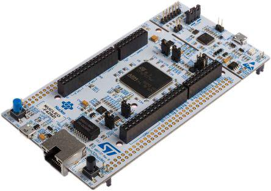
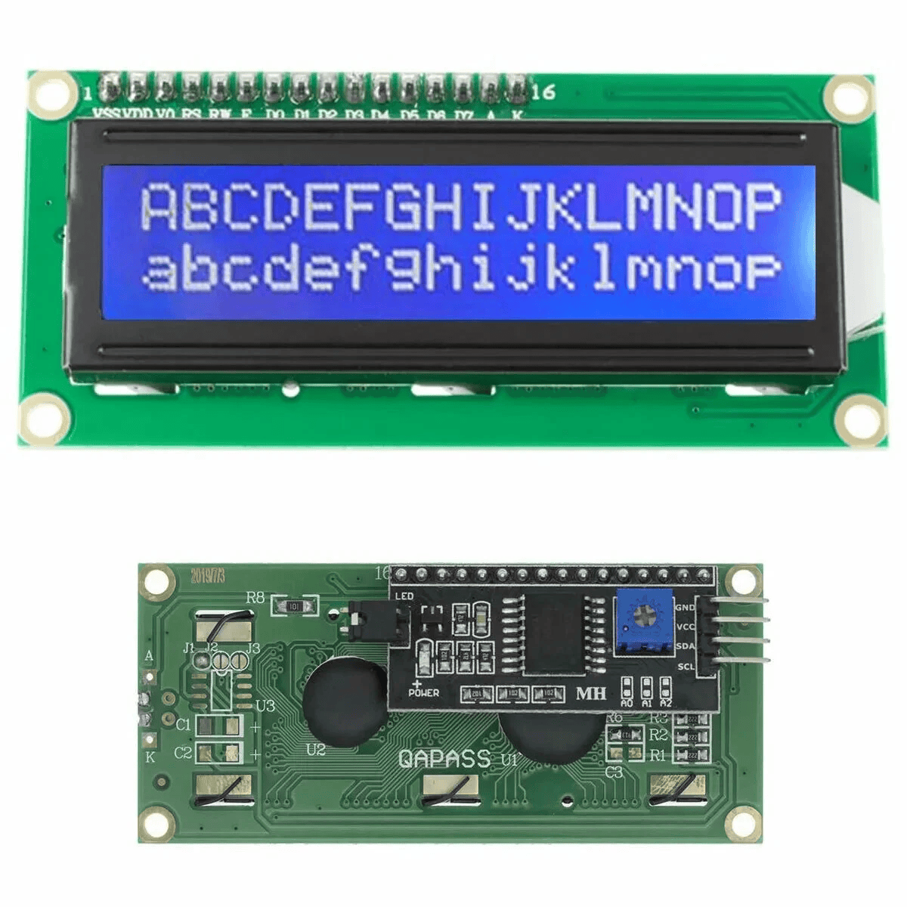
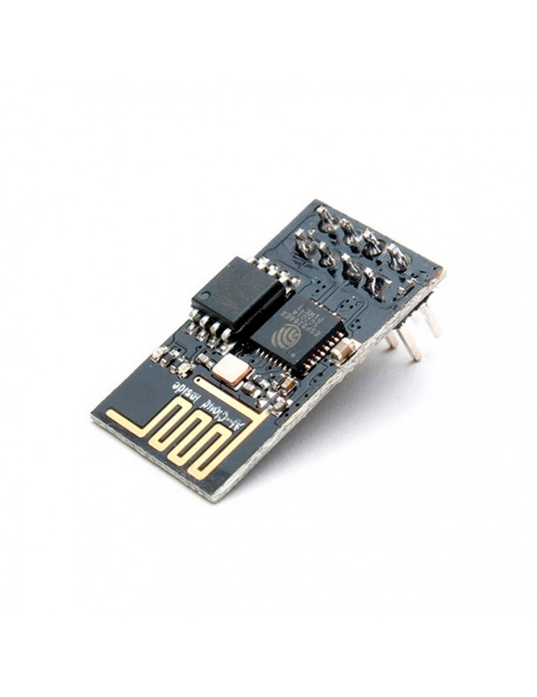
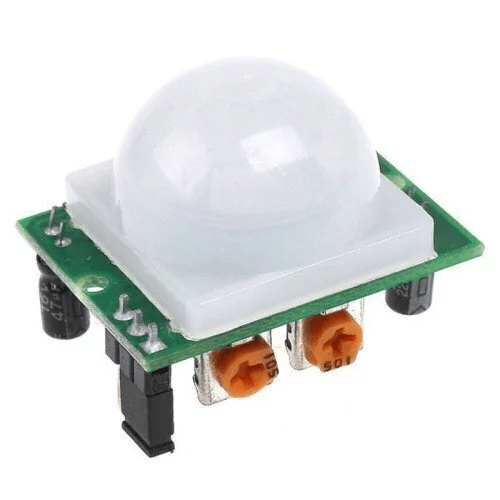
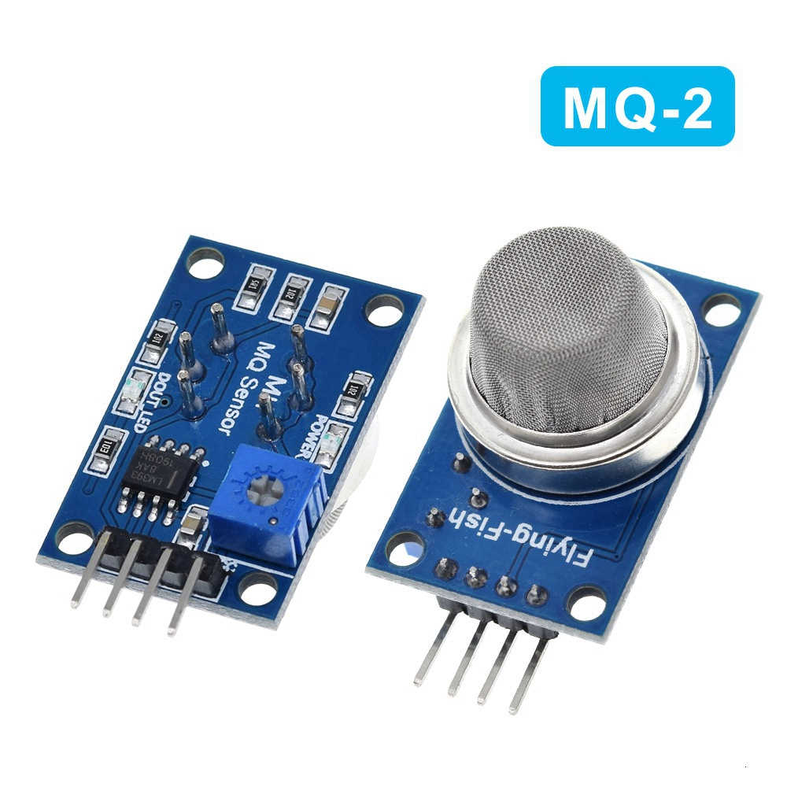
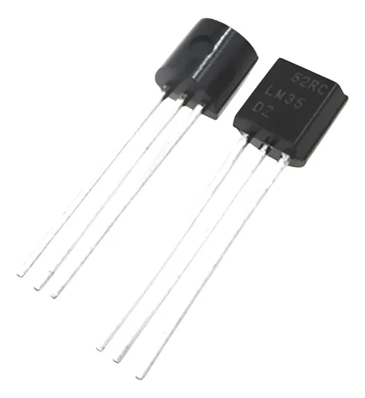
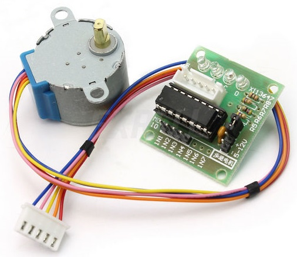

# SiMBa (Sistama de Monitoreo de Basura)

## Alumno: Agustín Ruiz
## Fecha: 2. º cuatrimestre 2024

# Memoria del Trabajo Final: SiMBa (Sistama de Monitoreo de Basura)

**Universidad de Buenos Aires**
**Facultad de Ingeniería**
**86.65 Sistemas Embebidos**

**Autor:** Agustín Ezequiel Ruiz

**Padrón:** 99124

**Profesores:** 
Ariel Lutenberg, Jorge Graña y Juan Cruz

*Este trabajo fue realizado en la Ciudad de Buenos Aires entre Agosto 2024 y Agosto de 2025.*

## Resumen
Este proyecto se trata de un sistema embebido para monitorear contenedores de basura para una recoleccion eficiente de los reciduos implementado con la placa de desarrollo STM32 Nucleo-F429ZI y la placa ESP-01. 
El sistema monitorea variables como temperatura, estado de la tapa, y presencia de gases inflamables y actua automaticamente siguiendo una maquina de estados. 
El dispositivo incluye conectividad mediante WiFi, lo que permite un control remoto y la posibilidad de realizar un monitoreo centralizado asi como tambien su control. 

Este trabajo tiene como fundamento que los recursos son escasos y debe hacerce un uso eficiente de los mismos. Los camiones de basura pueden reducir las emisiones de gases de efecto invernadero si siguen rutas optimizadas. 

## Tabla de Contenidos

- [1. Introducción](#1-introducción-general)
- [2. Introducción Específica](#capítulo-2-Introducción-específica)
- [3. Diseño e Implementación](#capítulo-3-Diseño-e-implementación)
- [4. Ensayos y resultados](#capítulo-4-Ensayos-y-resultados)
- [5. Conclusiones](#capı́tulo-5-conclusiones)

## Registro de versiones

| **Revisión** | **Cambios realizados** |  **Fecha** |
|:------------:|:----------------------:|:----------:|
|       1      | Creación del documento | 11/07/2025 |
|       2      |                        |            |
|       3      |                        |            |

## 1. Introducción general

### 1.1. Objetivo
Desarrollar un sistema embebido para optimizar la gestión y recolección de residuos a nivel municipal, reduciendo la emisión de gases de efecto invernadero y contribuyendo al cuidado del medioambiente.

### 1.2. Introducción
La recolección y el tratamiento de los residuos es un problema serio, ya que impacta de manera directa en la calidad de vida. La recolección de la basura puede mejorarse si, en lugar de seguir rutas estáticas, se implementaran rutas dinámicas generadas mediante algoritmos de grafos que permitan obtener un recorrido de recolección óptimo. Para que esto sea posible, es necesario conocer el estado de los contenedores de basura. El primer desafío a resolver es encontrar la forma de recopilar el estado de los contenedores y centralizar esos datos para la posterior generación de una ruta.

El presente proyecto aborda esta problemática mediante el desarrollo de un sistema embebido que permite monitorear variables como capacidad, temperatura y presencia de gases inflamables, además de enviar dichas variables a un concentrador de datos que calcule una ruta de recolección óptima. Como agregado, también se propusieron controles adicionales sobre la tapa que, si bien no son necesarios para el recolector, sí lo son para el usuario.

Este proyecto abarca distintos tópicos de la materia Sistemas Embebidos, tales como máquinas de estado, puertos de uso general, entradas analógicas, comunicación UART, comandos AT y conectividad WiFi mediante el módulo ESP-01.

Con esta propuesta se busca mejorar el sistema de recolección de basura y, de este modo, optimizar los recursos.

### 1.2. Análisis de sistemas similares en el mercado

Se analizaron cinco contenedores de basura. Se muestra la comparación de características en la Tabla 1.

<table style="height: 359px; width: 1313px;" border="1" cellspacing="0" cellpadding="5">
<thead>
<tr style="height: 52px;">
<th style="height: 52px; width: 85px;">Caracter&iacute;stica</th>
<th style="height: 52px; width: 268px;">[Tacho inteligente de 10L](https://www.mercadolibre.com.ar/tacho-cesto-de-basura-inteligente-10-litros-con-sensor-color-blanco/p/MLA53137335)</th>
<th style="height: 52px; width: 200px;">[Cesto de basura inteligente](https://articulo.mercadolibre.com.ar/MLA-1508280537-tacho-cesto-de-residuos-blanco-apertura-automatica-de-15-lts-_JM)</th>
<th style="height: 52px; width: 200px;">[Contenedor Bigbelly Smart](<a href="https://bigbelly.com/products/bigbelly-smart">https://bigbelly.com/products/bigbelly-smart</a>)</th>
<th style="height: 52px; width: 245.469px;">[Contenedor bilateral - OMBU](https://ombuhigieneurbana.com.ar/contenedor-carga-bilateral.php)</th>
<th style="height: 52px; width: 289.531px;">[Contenedor Carga Trasera - OMBU](https://ombuhigieneurbana.com.ar/contenedor-carga-trasera.php)</th>
</tr>
</thead>
<tbody>
<tr style="height: 1px;">
<td style="height: 1px; width: 85px;">Capacidad</td>
<td style="height: 1px; width: 268px;">10 Litros</td>
<td style="height: 1px; width: 200px;">15 Litros</td>
<td style="height: 1px; width: 200px;">178 Litros</td>
<td style="height: 1px; width: 245.469px;">40/90/150 Litros</td>
<td style="height: 1px; width: 289.531px;">800/1200L</td>
</tr>
<tr style="height: 39px;">
<td style="height: 39px; width: 85px;">Conectividad</td>
<td style="height: 39px; width: 268px;">No posee.</td>
<td style="height: 39px; width: 200px;">No posee.</td>
<td style="height: 39px; width: 200px;">LoraWAN - WIFI</td>
<td style="height: 39px; width: 245.469px;">No Posee</td>
<td style="height: 39px; width: 289.531px;">No posee.</td>
</tr>
<tr style="height: 13px;">
<td style="height: 13px; width: 85px;">Apertura</td>
<td style="height: 13px; width: 268px;">Con sensor, sin contacto.</td>
<td style="height: 13px; width: 200px;">Con sensor, sin contacto.</td>
<td style="height: 13px; width: 200px;">Con pie. Tapa Lateral</td>
<td style="height: 13px; width: 245.469px;">Dos tapas laterales. Descarga de residuos inferior.</td>
<td style="height: 13px; width: 289.531px;">Una tapa superior.&nbsp;</td>
</tr>
<tr style="height: 13px;">
<td style="height: 13px; width: 85px;">Fuente de alimentaci&oacute;n</td>
<td style="height: 13px; width: 268px;">4 Pilas AA</td>
<td style="height: 13px; width: 200px;">2 Pilas AA</td>
<td style="height: 13px; width: 200px;">Panel Solar y bater&iacute;a recargable.&nbsp;</td>
<td style="height: 13px; width: 245.469px;">No posee.</td>
<td style="height: 13px; width: 289.531px;">No posee.</td>
</tr>
<tr style="height: 26px;">
<td style="height: 26px; width: 85px;">Usos</td>
<td style="height: 26px; width: 268px;">Privado, adentro de una casa.</td>
<td style="height: 26px; width: 200px;">Privado, adentro de una casa.</td>
<td style="height: 26px; width: 200px;">P&uacute;blico. Sistema de recolecci&oacute;n de residuos. Peque&ntilde;os reciduos (latas, bolsas de comida, m&aacute;x 5 Litros) por el tama&ntilde;o de la tapa.&nbsp;</td>
<td style="height: 26px; width: 245.469px;">P&uacute;blico-urbano. Sistema de recolecci&oacute;n de residuos.</td>
<td style="height: 26px; width: 289.531px;">P&uacute;blico-urbano. Sistema de recolecci&oacute;n de residuos.</td>
</tr>
<tr style="height: 13px;">
<td style="height: 13px; width: 85px;">Caracter&iacute;sticas Extras</td>
<td style="height: 13px; width: 268px;">Pl&aacute;stico, posee led indicador. tapa extra&iacute;ble.</td>
<td style="height: 13px; width: 200px;">Pl&aacute;stico, posee led indicador. tapa extra&iacute;ble.</td>
<td style="height: 13px; width: 200px;">Antiband&aacute;lico, materiales reforzados. Sistema de monitoreo del estado del contenedor en tiempo real.&nbsp;</td>
<td style="height: 13px; width: 245.469px;">Reforzado, met&aacute;lico, adaptable con sistema antiband&aacute;lico. Dise&ntilde;ado para sistemas de recolecci&oacute;n de basura.</td>
<td style="height: 13px; width: 289.531px;">Reforzado, met&aacute;lico. Utilidad campos, barrios cerrados, municipios. Alta capacidad.&nbsp;&nbsp;</td>
</tr>
</tbody>
</table>

<em>Tabla 1: Comparaci&oacute;n de productos de mercado</em>

## Capítulo 2. Introducción específica

### 2.1. Requisitos

En la tabla 2 se muestran los requisitos del sistema desarrollado.

<table>
<thead>
<tr style="height: 13px;">
<th style="height: 13px;">Grupo de requisitos</th>
<th style="height: 13px;">Id</th>
<th style="height: 13px;">Descripci&oacute;n</th>
</tr>
</thead>
<tbody>
<tr style="height: 13px;">
<td style="height: 65px;" rowspan="5">1. Control</td>
<td style="height: 13px;">1.1</td>
<td style="height: 13px;">El sistema deber&aacute; bloquear la tapa si el contenedor esta lleno.</td>
</tr>
<tr style="height: 13px;">
<td style="height: 13px;">1.2</td>
<td style="height: 13px;">El sistema deber&aacute; abrir la tapa si detecta la presencia de un usuario.</td>
</tr>
<tr style="height: 13px;">
<td style="height: 13px;">1.3</td>
<td style="height: 13px;">El sistema deber&aacute; cerrar la tapa si esta en ausencia de un usuario.</td>
</tr>
<tr style="height: 13px;">
<td style="height: 13px;">1.4</td>
<td style="height: 13px;">La tapa deber&aacute; poder desbloquearse por medio de Wi-Fi o UART</td>
</tr>
<tr style="height: 13px;">
<td style="height: 13px;">1.5</td>
<td style="height: 13px;">El contenedor deber&aacute; encender una alarma auditiva si se detecta gas metano.</td>
</tr>
<tr style="height: 13px;">
<td style="height: 39px;" rowspan="3">2. Interacci&oacute;n con el usuario</td>
<td style="height: 13px;">2.1</td>
<td style="height: 13px;">El usuario puede controlar el contenedor desde una pagina web.</td>
</tr>
<tr style="height: 13px;">
<td style="height: 13px;">2.2</td>
<td style="height: 13px;">El usuario puede consultar el estado desde una pagina web, o consultar el display del contenedor.</td>
</tr>
<tr style="height: 13px;">
<td style="height: 13px;">2.3</td>
<td style="height: 13px;">El display se enciende solo bajo la presencia de un usuario.</td>
</tr>
<tr style="height: 13.6528px;">
<td style="height: 65.6528px;" rowspan="4">3. El servicio web</td>
<td style="height: 13.6528px;">3.1</td>
<td style="height: 13.6528px;">El servicio web puede ser accedido desde un browser.</td>
</tr>
<tr style="height: 13px;">
<td style="height: 13px;">3.2</td>
<td style="height: 13px;">El servicio web ofrece un men&uacute; de acciones para controlar el contenedor.</td>
</tr>
<tr style="height: 13px;">
<td style="height: 13px;">3.3</td>
<td style="height: 13px;">El servicio web ofrece una api web para controlar el contenedor de forma programable.</td>
</tr>
<tr style="height: 13px;">
<td style="height: 13px;">3.4</td>
<td style="height: 13px;">El servicio web ofrece m&eacute;tricas del estado del contenedor.</td>
</tr>
<tr style="height: 13px;">
<td style="height: 26px;" rowspan="2">4. Alimentaci&oacute;n</td>
<td style="height: 13px;">4.1</td>
<td style="height: 13px;">La alimentaci&oacute;n es por medio de una bater&iacute;a de 5 V.</td>
</tr>
<tr style="height: 13px;">
<td style="height: 13px;">4.2</td>
<td style="height: 13px;">La carga de la bater&iacute;a es por medio de un panel solar.</td>
</tr>
</tbody>
</table>

<em>Tabla 2: Requisitos del proyecto</em>

**Tabla 2.1: Requisitos del sistema automático.**

### 2.2. Casos de uso
En las tablas 3, 4 y 5 se presentan tres casos de uso del sistema representativos de su funcionalidad.

---

| Elemento | Definición |
|----------|------------|
| Disparador | El usuario se acerca al contenedor |
| Precondición | El contenedor esta cerrado |
| Flujo básico | 1. El contenedor detecta la presencia del usuario.   2. El contenedor abre la tapa.   3. El usuario deposita la basura.   4. El usuario se aleja del contenedor.   5. El contenedor cierra la tapa. |
| Flujo alternativo | 1. El contenedor detecta la presencia del usuario.   2. El display indica al usuario que esta lleno.   3. El usuario lee el display.   4. El usuario se aleja del contenedor. |

<em>Tabla 3: Caso de uso 1: Un usuario arroja un residuo.</em>

---

| Elemento | Definición |
|----------|------------|
| Disparador | El contenedor detecta gas metano |
| Precondición | El contenedor esta cerrado |
| Flujo básico | 1. El contenedor detecta gas metano.   2. El contenedor emite una alarma auditiva.   3. La página web cambia el estado del contenedor a "Alerta". |
| Flujo alternativo | 1. El contenedor detecta gas metano.   2. El contenedor emite una alarma auditiva.   3. La página web cambia el estado del contenedor a "Alerta".   4. Un servidor llama a la api y detecta la alerta.   5. El servidor envía un mail al encargado de la recolección. |

<em>Tabla 4: Caso de uso 2: Gas Metano.</em>

---

| Elemento | Definición |
|----------|------------|
| Disparador | El contenedor se llenó |
| Precondición | El contenedor esta cerrado |
| Flujo básico | 1. El contenedor detecta que esta lleno.   2. El contenedor bloquea la tapa.   3. La página web cambia el estado del contenedor a "Lleno". |
| Flujo alternativo | 1. El contenedor detecta que esta lleno.   2. El contenedor bloquea la tapa.   3. La página web cambia el estado del contenedor a "Lleno".   4. Un servidor llama a la api y detecta el estado.   5. El servidor envía un mail al encargado de la recolección.   6. El recolector se hacerca al contenedor, desbloquea al contenedor con la página web y recolecta la basura. |

<em>Tabla 5: Caso de uso 3: Contenedor lleno.</em>

### 2.3. Descripción de módulos utilizado

En base a la arquitectura de control y los requisitos establecidos se decidió por utilizar los módulos que se
describen a continuación.

#### 2.3.1. Placa Nucleo F429ZI
Este es el microcontrolador principal utilizado en el proyecto. Se programó con el lenguaje C++ y el framework MBed-OS. Este módulo superó ampliamente los requerimientos del proyecto gracias a su gran cantidad de puertos y caracteristicas disponibles de prototipado.

    

<em>Figura 1: Placa Núcleo F429ZI</em>

#### 2.3.2. Módulo del display grafico
Para la presentación de información al usuario se utilizó un display 1602 azul junto con un módulo I2C para recibir los datos desde la placa. 

    

<em>Figura 2: Modulo display 1602 con módulo I2C.</em>

#### 2.3.3. Módulo Wi-Fi
Para la implementación del servidor web se utilizó la ESP01. La pagina web se almacenó en la placa núcleo. La comunicación con la placa principal se dió por medio de una conexión UART y comandos AT.

    

<em>Figura 3: Modulo Wi-Fi ESP01 - ESP8266</em>

#### 2.3.4.  Sensor presencia (Sensor PIR)
El modulo HC-Sr501 se utilizó para detectar la presencia de un usuario. Al acercar la mano, el sensor devulve un estado alto. 

    

<em>Figura 4: sensor PIR.</em>

#### 2.3.5.  Sensor de gas MQ-2
Este sensor se utilizó para detectar la presencia de gas. 

    

<em>Figura 5: sensor PIR.</em>

#### 2.3.5.  Sensor de temperatura LM-35
Este sensor se utilizó para obtener la temperatura del ambiente. Se añado un circuito para amplificar la salida del sensor y ajustarla a un valor que puediera ser mejor interpretado por la placa núcleo. 

    

<em>Figura 5: sensor PIR.</em>

#### 2.3.6.  Motor a pasos 28BYJ-48
Motor a pasos utilizado como actuador de la tapa para abrir y cerrar. 

    

<em>Figura 6: sensor PIR.</em>

## Capítulo 3. Diseño e implementación

### 3.1.Hardware

#### 3.1.1. Diagrama en bloques

En la Figura 3.1 se muestra un diagrama del hardware del sistema desarrollado.

    

<em>Figura 3.1: Diagrama en bloque del sistema</em>

#### 3.1.2. Lista de señales
En la tabla 3.1 se listan las señales del sistema, indicando la conexión de los puertos de la placa NUCLEO-
F429ZI a los módulos de hardware.

<table style="width: 415px;">
<thead>
<tr style="height: 23px;">
<th style="height: 23px; width: 202px;" colspan="2">Pin del m&oacute;dulo de hardware</th>
<th style="height: 23px; width: 208px;" colspan="2">Pin de la placa Nucleo-F429ZI</th>
</tr>
</thead>
<tbody>
<tr style="height: 23px;">
<td style="height: 92px; width: 132.467px;" rowspan="4">SSD1306</td>
<td style="height: 23px; width: 69.5333px;">SCL</td>
<td style="height: 23px; width: 69px;">PB_8</td>
<td style="height: 23px; width: 139px;">I2C1_SCL</td>
</tr>
<tr style="height: 23px;">
<td style="height: 23px; width: 69.5333px;">SDA</td>
<td style="height: 23px; width: 69px;">PB_9</td>
<td style="height: 23px; width: 139px;">I2C1_SDA</td>
</tr>
<tr style="height: 23px;">
<td style="height: 23px; width: 69.5333px;">VCC</td>
<td style="height: 23px; width: 69px;">3V3</td>
<td style="height: 23px; width: 139px;">3V3</td>
</tr>
<tr style="height: 23px;">
<td style="height: 23px; width: 69.5333px;">GND</td>
<td style="height: 23px; width: 69px;">GND</td>
<td style="height: 23px; width: 139px;">GND</td>
</tr>
<tr style="height: 23px;">
<td style="height: 69.5px; width: 132.467px;" rowspan="3">HW-827</td>
<td style="height: 23px; width: 69.5333px;">VCC</td>
<td style="height: 23px; width: 69px;">3V3</td>
<td style="height: 23px; width: 139px;">3V3</td>
</tr>
<tr style="height: 23.5px;">
<td style="height: 23.5px; width: 69.5333px;">SIGNAL</td>
<td style="height: 23.5px; width: 69px;">PA_3</td>
<td style="height: 23.5px; width: 139px;">A0</td>
</tr>
<tr style="height: 23px;">
<td style="height: 23px; width: 69.5333px;">GND</td>
<td style="height: 23px; width: 69px;">GND</td>
<td style="height: 23px; width: 139px;">GND</td>
</tr>
<tr style="height: 23px;">
<td style="height: 92px; width: 132.467px;" rowspan="4">NODEMCU8266</td>
<td style="height: 23px; width: 69.5333px;">TX</td>
<td style="height: 23px; width: 69px;">PE_9</td>
<td style="height: 23px; width: 139px;">&nbsp;UART7_RX</td>
</tr>
<tr style="height: 23px;">
<td style="height: 23px; width: 69.5333px;">RX</td>
<td style="height: 23px; width: 69px;">PE_8</td>
<td style="height: 23px; width: 139px;">&nbsp;UART7_TX</td>
</tr>
<tr style="height: 23px;">
<td style="height: 23px; width: 69.5333px;">VIN</td>
<td style="height: 23px; width: 69px;">5V</td>
<td style="height: 23px; width: 139px;">5V</td>
</tr>
<tr style="height: 23px;">
<td style="height: 23px; width: 69.5333px;">GND</td>
<td style="height: 23px; width: 69px;">GND</td>
<td style="height: 23px; width: 139px;">&nbsp;GND</td>
</tr>
</tbody>
</table>

&nbsp;

<em>Tabla 3.1: Lista de señales del sistema</em>

### 3.2. Firmware

#### 3.2.1. Repositorio
Todo el código del proyecto se encuentra en el repositorio git en [3].

#### 3.2.2. Tecnologı́a
El sistema se encuentra implementado en C++ utilizando Mbed. El firmware presenta un archivo main.cpp el cual lo único que realiza es llamar a las funciones inicio de sistema, y en el lazo principal, la funcion de actualizacion del sistema.

#### 3.2.3. Estructura del repositorio

| Directorio/Archivo        | Contenido principal                                          |
|-------------------|--------------------------------------------------------------|
| `SE_1c2025_TP1/`            | Archivos fuente del proyecto                                 |
| `SE_1c2025_TP1/modules/button/`       | Control de botón de usuario con maquina de estados      |
| `SE_1c2025_TP11/modules/display/`    | Funciones gráficas para el display SSD1306                   |
| `SE_1c2025_TP1/modules/heart_monitor_system/` | Lógica principal y configuración del sistema     |
| `SE_1c2025_TP1/modules/pulse_sensor/`    | Funciones de control de sensor de pulso cardiaco         |
| `SE_1c2025_TP1/modules/serial_com/`    | Funciones de escritura por puerto serie                 |
| `SE_1c2025_TP1/modules/wifi_com/`    | Funciones de control de modulo Wi-Fi por puerto serie                 |
| `SE_1c2025_TP1/modules/data_history/`    | Funciones para guardar registros historicos       |
| `SE_1c2025_TP1/main.cpp`    | Archivo principal de ejecución          |
| `SE_1c2025_TP1/mbed_app.json`    | Archivo de configuracion para el compilador     |

<em>Tabla 3.2: Estructura de directorios y modulos</em>

| Nombre de elemento        | Tipo                          |      Descripción   |
|-------------------|-----------------------|---------------------------------------|
| hw827         | Objeto AnalogIn      | Se usa para leer la etrada analogica A0 de la placa Nucleo donde se conecta el HW-827.      |
| bpm         | Variable float      | Se usa guardar valores finales calculados de bpm (usa valor anterior).      |
| bpm_actual         | Variable float      | Se usa guardar el valor calculado actual de bpm.      |
| intervals         | Variable uint32      | Guarda los ultimos cuatro valores de intervalos entre pulsos.     |

<em>Tabla 3.3: Objetos y Variables del modulo pulse_sensor</em>

| Nombre de elemento        | Tipo                          |      Descripción   |
|-------------------|-----------------------|---------------------------------------|
| i2c         | Objeto I2C      | Se usa para la comunicacion I2C donde se conecta el SSD1306.      |

<em>Tabla 3.4: Objetos y Variables del modulo display</em>

| Nombre de elemento        | Tipo                          |      Descripción   |
|-------------------|-----------------------|---------------------------------------|
| wifiComState_t         | Typedef      | Se usa para informar el estado de la maquina de estados de comunicacion Wi-Fi.      |
| uartWifi         | Objeto UnbufferedSerial      | Se usa para la comunicacion serie del modulo NODEMCU8266      |

<em>Tabla 3.5: Objetos y Variables del modulo wifi_com</em>

| Nombre de elemento        | Tipo                          |      Descripción   |
|-------------------|-----------------------|---------------------------------------|
| buttonState_t         | Typedef      | Se usa para informar el estado de la maquina de estados de pulsado de boton.      |
| button         | Objeto DigitalIn      | Se usa para detectar estado del boton de usuario BUTTON1     |

<em>Tabla 3.6: Objetos y Variables del modulo button</em>

A partir de la tabla 3.7 a tabla 3.12 se presentan las funciones publicas de cada modulo.

| Nombre de la función        | Descripción                          |      Archivo que lo usa   |
|-------------------|-----------------------|---------------------------------------|
| heartMonitorSystemInit()         | Inicializa todos los modulos y configuración inicial del sistema.      | main.cpp   |
| heartMonitorSystemUpdate()        | Se encarga la logica del programando llamando a funciones de actualización.      | main.cpp   |

<em>Tabla 3.7: Funciones publicas del modulo heart_monitor_system</em>

| Nombre de la función        | Descripción                          |      Archivo que lo usa   |
|-------------------|-----------------------|---------------------------------------|
| readBPM()         | Calcula un valor de lectura de pulso cardiaco      | heart_monitor_system.cpp   |
| getBPM()        | Entrega el valor obtenido del ultimo calculo de pulso cardiaco      | heart_monitor_system.cpp y wifi_com.cpp   |

<em>Tabla 3.8: Funciones publicas del modulo pulse_sensor</em>

| Nombre de la función        | Descripción                          |      Archivo que lo usa   |
|-------------------|-----------------------|---------------------------------------|
| ssd1306_init()         | Inicializa el display OLED SSD1306      | heart_monitor_system.cpp   |
| ssd1306_clear_display()        | Borra toda la pantalla del display      | heart_monitor_system.cpp   |
| ssd1306_print()        | Imprime caracteres en display considerando posicion    | heart_monitor_system.cpp   |
| ssd1306_clear_display_middle()       | Borra parte media o central del display (lectura de BPM)     | heart_monitor_system.cpp   |
| ssd1306_clear_top_rows()        | Borra parte superior del display (alertas)      | heart_monitor_system.cpp  |

<em>Tabla 3.9: Funciones publicas del modulo display</em>

| Nombre de la función        | Descripción                          |      Archivo que lo usa   |
|-------------------|-----------------------|---------------------------------------|
| debounceButtonInit()         | Inicia el  estado inicial del boton de usuario      | heart_monitor_system.cpp   |
| debounceButtonUpdate()        | Actualiza estado de boton mediante una maquina de estados      | heart_monitor_system.cpp   |

<em>Tabla 3.10: Funciones publicas del modulo button</em>

| Nombre de la función        | Descripción                          |      Archivo que lo usa   |
|-------------------|-----------------------|---------------------------------------|
| addRegisterData()         | Agrega una lectura al registro de lecturas con fecha y hora     | heart_monitor_system.cpp   |

<em>Tabla 3.11: Funciones publicas del modulo data_history</em>

| Nombre de la función        | Descripción                          |      Archivo que lo usa   |
|-------------------|-----------------------|---------------------------------------|
| wifiComInit()         | Inicia el modulo Wi-Fi mediante comandos AT      | heart_monitor_system.cpp   |
| wifiComUpdate()      | Actualiza la conexion Wi-Fi mediante una maquina de estados      | heart_monitor_system.cpp   |

<em>Tabla 3.12: Objetos y Variables del modulo wifi_com</em>

#### 3.2.6. Arquitectura
En la figura 3.3 se muestra el diagrama de flujo del firmware.

    

 

<em>Figura 3.3: Diagrama de flujo principal del firmware</em>

## Capítulo 4. Ensayos y resultados

### 4.1. Pruebas funcionales del hardware
Las pruebas funcionales del hardware se realizaron por módulos.

### 4.1.1. Módulo Wi-Fi NODEMCU8266
Se cargo el firmware AT en el modulo. Luego por conexion USB y comunicacion por el puerto serie se constato el correcto envio de comandos y sus respuestas. Ademas, mediante esos comandos se estableció conexion con la red usada por defecto.

### 4.1.2. Módulo Sesor de pulso HW-827
El estudio inició con la toma de una medida de la señal analógica a través de un osciloscopio, con el propósito de analizar tanto los niveles como el comportamiento de dicha señal durante la lectura de pulsos. Para ello, se procedió a la conexión de la señal a los 3,3 V y GND de la placa núcleo, evidenciándose la presencia de picos de amplitud asociados a la detección de pulsos, junto con la observación de ruido de interferencia superpuesto en la señal. 
Posteriormente, se llevó a cabo un experimento adicional empleando la placa núcleo junto con el software SerialPlot. A través de esta herramienta, se lograron determinar la frecuencia de muestreo óptima, los umbrales de detección y los filtros necesarios para asegurar una correcta lectura de pulsos.

### 4.1.3. Modulo Display OLED SSD1306

Para este caso se evaluaron las funciones desarrolladas de escritura y borrado, visualizando la pantalla del display. Se constato que los datos en la pantalla fueran los correctos y luego el borrado de pantalla.

### 4.1.8. Pruebas de integracion
Las pruebas de integración realizadas se encuentran en formato de video en el siguiente enlace:

Donde se verificó:
* Disposición del hardware.
* Lógica del funcionamiento del sistema.
* Comandos por puerto serie.
* Monitoreo mediante el servidor web.
* Alertas de umbrales.
* Registro de datos historicos.

### 4.1.9. Cumplimiento de requisitos
En la tabla 4.1 se presenta la evaluación del cumplimiento de los requisitos iniciales de la tabla 2.1. Se evaluó
a el estado actual de cada uno indicando en verde aquellos que ya fueron cumplidos y en rojo los requerimientos
no cumplidos.

| Grupo         | ID   | Descripción                                                                                                         | Estado |
| :------------ | :----| :------------------------------------------------------------------------------------------------------------------|---------------|
| Monitoreo       | 1.1   | El sistema sensará la frecuencia cardíaca en tiempo real mediante un sensor integrado al dispositivo.               |  🟢         |
|                 | 1.2   | El sistema almacenará localmente los datos de frecuencia cardíaca para asegurar la continuidad en caso de desconexión.|  🟢         |
| Visualización   | 2.1   | El dispositivo mostrará en su display local la frecuencia cardíaca en tiempo real, con valores numéricos. |  🟢         |
|                 | 2.2   | La aplicación web y móvil permitirá visualizar la frecuencia cardíaca en tiempo real mediante valores numéricos actualizados cada cinco segundos, asegurando sincronización continua con el dispositivo. |  🟢         |
|                 | 2.3   | La aplicación almacenará y mostrará datos históricos de frecuencia cardíaca, permitiendo al usuario consultar tendencias diarias, semanales y mensuales. |  🟢         |
| Alertas         | 3.1   | El sistema debe detectar eventos anómalos (frecuencia fuera de rango) y generar alertas visuales, y notificaciones. |  🟢         |
|                 | 3.2   | El sistema enviará notificaciones inmediatas a la aplicacion web cuando se detecten anomalías.    |  🟢         |
| Configuración   | 4.1   | El sistema permitirá configurar parámetros como umbrales de alerta y etiqueta de usuario desde la aplicación remota. |  🟢         |
| Comunicación    | 5.1   | El sistema contará con una aplicación web accesible vía navegador desde dispositivos móviles y de escritorio. La aplicación permitirá monitorear datos en tiempo real y recibir notificaciones |  🟢         |
| Proyecto        | 6.1   | El prototipo será acompañado de la lista de partes, el repositorio de código con su documentación, y un manual de uso. |  🟢         |

<em>Tabla 4.1: Estado de requisitos.</em>

### 4.1.10. Comparación con otros sistemas similares

En la Tabla 4.2 se puede observar la continuación del análisis de la Sección 1.2, donde se puede ver ahora sumado 
a la comparación al sistema de monitoreo realizado.

<table border="1" cellspacing="0" cellpadding="5">
<thead>
<tr>
<th>Caracter&iacute;stica</th>
<th>[MAGENE H303](https://www.magene.com/en/sensors/52-h303-heart-rate-monitor.html)</th>
<th>[POLAR Verity Sense](https://www.polar.com/us-en/products/accessories/polar-verity-sense)</th>
<th>[WELLUE O2Ring](https://getwellue.com/pages/o2ring-oxygen-monitor)</th>
<th>&nbsp;</th>
<th>[Wellue Oxiband](https://www.mercadolibre.com.ar/oximetro-de-pulso-wellue-oxiband-con-app-y-recordatorio/p/MLA50740493)</th>
<th>Sistema de monitoreo de frecuencia cardiaca (Este proyecto)</th>
</tr>
</thead>
<tbody>
<tr>
<td>Tipo de sensor</td>
<td>Banda tor&aacute;cica con sensor ECG</td>
<td>Banda &oacute;ptica para brazo (PPG)</td>
<td>Anillo con sensor &oacute;ptico (PPG)</td>
<td>&nbsp;</td>
<td>Sensor &oacute;ptico PPG para SpO2 y pulso</td>
<td>&Oacute;ptico</td>
</tr>
<tr>
<td>Rango frecuencia card&iacute;aca</td>
<td>30 - 240 bpm</td>
<td>30 - 220 bpm</td>
<td>No especificado (pulso y SpO2)</td>
<td>&nbsp;</td>
<td>30 - 250 bpm</td>
<td>30 - 220 bpm</td>
</tr>
<tr>
<td>Duraci&oacute;n bater&iacute;a</td>
<td>Hasta 1000 horas</td>
<td>Hasta 20 horas</td>
<td>Hasta 14 horas</td>
<td>&nbsp;</td>
<td>Aproximadamente 8 horas</td>
<td>&nbsp;-</td>
</tr>
<tr>
<td>Tipo de bater&iacute;a</td>
<td>Pila bot&oacute;n CR2032</td>
<td>Bater&iacute;a recargable integrada</td>
<td>Bater&iacute;a recargable integrada</td>
<td>&nbsp;</td>
<td>Bater&iacute;a recargable integrada</td>
<td>&nbsp;-</td>
</tr>
<tr>
<td>Conectividad inal&aacute;mbrica</td>
<td>Bluetooth 4.2 y ANT+</td>
<td>Bluetooth 5.0</td>
<td>Bluetooth 4.0</td>
<td>&nbsp;</td>
<td>Bluetooth 4.0</td>
<td>Wi-Fi</td>
</tr>
<tr>
<td>Impermeabilidad</td>
<td>IP67 (resistente al agua y polvo)</td>
<td>Resistente al agua (IPX7)</td>
<td>IP24 (resistente a salpicaduras)</td>
<td>&nbsp;</td>
<td>No especificado</td>
<td>&nbsp;-</td>
</tr>
<tr>
<td>Display</td>
<td>No incluye display (se conecta a apps o dispositivos externos)</td>
<td>No incluye display (se conecta a apps)</td>
<td>No incluye display (datos en app)</td>
<td>&nbsp;</td>
<td>S&iacute;, display OLED integrado</td>
<td>&nbsp;S&iacute;, display OLED integrado</td>
</tr>
<tr>
<td>Audio / alertas</td>
<td>No incluye</td>
<td>No incluye</td>
<td>Vibraci&oacute;n para alertas</td>
<td>&nbsp;</td>
<td>Alarmas sonoras y visuales</td>
<td>Alertas visuales</td>
</tr>
<tr>
<td>Precio aproximado</td>
<td>$30 - $40 USD</td>
<td>$90 - $120 USD</td>
<td>$150 - $200 USD</td>
<td>&nbsp;</td>
<td>$600 - $800 USD</td>
<td>$30 - $52 USD</td>
</tr>
<tr>
<td>Uso principal</td>
<td>Monitoreo deportivo y fitness</td>
<td>Monitoreo deportivo y salud continua</td>
<td>Monitoreo m&eacute;dico de SpO2 y pulso</td>
<td>&nbsp;</td>
<td>Monitoreo m&eacute;dico de SpO2 y frecuencia card&iacute;aca</td>
<td>Monitoreo de salud hogareño.</td>
</tr>
</tbody>
</table>

<em>Tabla 4.2: Comparación de características de productos analizados previamente y este proyecto</em>

### 4.2. Documentación del desarrollo realizado

<table><thead>
  <tr>
    <th>Elemento</th>
    <th>Referencia</th>
  </tr></thead>
<tbody>
  <tr>
    <td>Presentación del proyecto</td>
    <td>Capı́tulo 1</td>
  </tr>
  <tr>
    <td>Listado de requisitos</td>
    <td>Tabla 2.1</td>
  </tr>
  <tr>
    <td>Casos de uso del proyecto</td>
    <td>Tablas 2.2 a 2.4</td>
  </tr>
  <tr>
    <td>Diagrama en bloques del sistema</td>
    <td>Figura 3.1</td>
  </tr>
  <tr>
    <td>Lista de señales</td>
    <td>Tabla 3.1</td>
  </tr>
  <tr>
    <td>Implementación del hardware</td>
    <td>Sección 3.1</td>
  </tr>
  <tr>
    <td>Módulos de software</td>
    <td>Sección 3.2</td>
  </tr>
  <tr>
    <td>Repositorio</td>
    <td>[5]</td>
  </tr>
  <tr>
    <td>Cumplimiento de requisitos</td>
    <td>Tabla 4.1</td>
  </tr>
  <tr>
    <td>Conclusiones finales</td>
    <td>Capı́tulo 5</td>
  </tr>
</tbody>
</table>

<em>Tabla 4.3: Elementos del sumario del sistema automático para el sistema de monitoreo de frecuencia cardiaca</em>

## Capı́tulo 5 Conclusiones

### 5.1. Resultados obtenidos
El desarrollo del sistema de monitoreo de frecuencia cardíaca permitió cumplir con los objetivos planteados inicialmente. Se logró la integración exitosa de un sensor óptico de pulso, un display OLED para la visualización en tiempo real de los latidos por minuto (BPM), y un módulo de conectividad Wi-Fi para la transmisión, tanto de lecturas en tiempo real, alertas y datos históricos, en una plataforma remota.

El sistema mostró una lectura estable del pulso en tiempo real durante las pruebas. La implementación de umbrales configurables permitió activar alertas cuando la frecuencia cardíaca superó o descendió de ciertos valores establecidos, lo que demuestra su potencial como herramienta preventiva o de monitoreo continuo en contextos personales o deportivos.

Además, se logró un registro automático de los datos, lo cual facilita su análisis posterior y el seguimiento de patrones a lo largo del tiempo. La interfaz en el display OLED resultó clara y funcional para la visualización inmediata del estado del usuario.

### 5.1. Proximos pasos

Si bien el sistema ha demostrado un buen funcionamiento, se identificaron oportunidades de mejora y expansión que podrían implementarse en futuras iteraciones del proyecto:

1. Agregar una conectividad Bluetooth para tener mayor control y configuracion de redes Wi-Fi.
2. Incorporar el uso de baterias para tener un sistema portable.
1. Mejora de la precisión del sensor: Evaluar la integración de sensores ópticos más avanzados o de múltiples canales para reducir interferencias y mejorar la fiabilidad de las mediciones en distintos tipos de piel y condiciones de movimiento.
2. Almacenamiento en la nube y análisis inteligente: Incorporar servicios en la nube para almacenamiento seguro, y aplicar algoritmos de análisis de datos para detectar anomalías o tendencias relevantes en la frecuencia cardíaca del usuario.

    
## Bibliografı́a
[1]  WORLD FAMOUS ELECTRONICS llc. [HW-827 Datasheet.](https://media.digikey.com/pdf/Data%20Sheets/Pulse%20Sensor%20PDFs/Pulse_Sensor.pdf)

[2] SOLOMON SYSTECH SEMICONDUCTOR TECHNICAL DATA. [SSD1306 Datasheet.](https://cdn-shop.adafruit.com/datasheets/SSD1306.pdf)

[3] Espressif Systems. [ESP8266 Datasheet.](https://www.espressif.com/sites/default/files/documentation/0a-esp8266ex_datasheet_en.pdf) 

[4] Lexus2k.[Bibliotecas y drivers de Displays.](https://github.com/lexus2k/ssd1306)

<a id="ref5">[5]</a>. Sergio Aguirre. Repositorio de proyecto. [Sistema de monitoreo de frecuencia cardiaca.](https://github.com/seragu9/SE_1c2025_TP1/tree/TPFinal/)